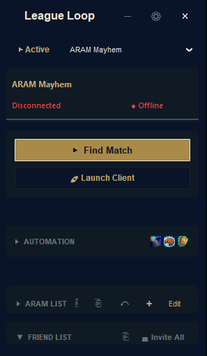

<div align="center">
  
  <h1>LeagueLoop-Lock</h1>
  <p><strong>Advanced Automation, Overlaid Elegance, and Ultimate Matchmaking Control for League of Legends</strong></p>
</div>

---

## ⚡ Overview

**LeagueLoop** is an autonomous League of Legends companion client written natively in Python utilizing **CustomTkinter** for a deeply modern, high-performance overlay experience. Operating seamlessly alongside the Riot Client and League Client Update (LCU), LeagueLoop bypasses repetitive UI workflows to get you into the Rift effortlessly.

Whether you're dodging queues, insta-locking ARAM priorities, or managing your automated lobby status, LeagueLoop provides a beautifully crafted control panel packed with highly responsive macros and logic.

## Screenshots

<div align="center">
  <table>
    <tr>
      <td align="center"><br/><sub>Lobby — Idle</sub></td>
      <td align="center"><br/><sub>Connected &amp; Ready</sub></td>
    </tr>
    <tr>
      <td align="center"><br/><sub>Champ Select — Live Drafting</sub></td>
      <td align="center"><br/><sub>Queue Mode Selector</sub></td>
    </tr>
  </table>
</div>

---

## 🔥 Features At A Glance

### 1. **Complete Automation Engine**
- **Auto-Accept Match**: Never miss a queue pop.
- **Priority Sniper & Auto-Pick**: Configure backup roles, custom bans, and insta-lock logic.
- **Draft Assistant (Role Enforcer)**: Role-based auto-hovering and banning for Ranked/Draft. Includes a teammate respect algorithm that dodges teammate hovers during the ban phase!
- **Arena Synergy Picker (V5)**: Rebuilt from the ground up for instantaneous one-click pair creation and streamlined Card Container aesthetics. Complete with Auto-Ban integration.
- **ARAM Mayhem Prioritization**: Drag-and-drop or select from your customized `ARAM List`. Ships with a default list consisting of top-played ARAM monsters *(Nautilus, Xerath, Heimerdinger, Master Yi, Veigar, etc.)*.
- **Event-Driven Architecture**: Fully thread-safe, zero-blocking API backend powered by real-time WebSocket subscriptions. No UI freezes, no missed queue pops.
- **Auto-Honor System**: Instantly honor friends or top-performers algorithmically via LCU APIs.
- **Auto-Join VIP Lobbies**: Automatically inject yourself into trusted lobbies.

### 2. **Beautiful, Real-Time Overlay UI**
- **Dynamic Friendlist**: Glowing indicators for active players with direct Auto-Join injection. Profile icons and LCU states sync live.
- **Status Magic**: Inject a `Custom Status` into your LoL Client from the UI.
- **Micro-Animations & Feedback**: Granular visual feedback for every user-interacted component.

### 3. **The "Orb" (Compact Mode)**
- Tired of huge windows during drafting? A single click (or shortcut) morphs LeagueLoop into a glowing, draggable **Orb** that stays above your client natively via Win32 OS-level injection hooks.

### 4. **Omnibar Palette** (Press `CTRL+K`)
- Rapid interface access: Switch queues *(Arena, TFT, ARAM Mayhem, Quickplay, etc.)*, reboot the League Client UX, wipe cache directories, or trigger Queue Roulette—all from a sleek command bar.

---

## 🛠 Prerequisites

- Windows 10/11
- Official Riot Client and League of Legends Installed.
- Python 3.10+ (If running from source)

---

## 📦 Installation & Setup

You can run LeagueLoop without compiling anything by downloading the setup file:

1. Download the latest **[LeagueLoop_Installer.exe](https://github.com/Intrusive-Thots/LeagueLoop-Installer)** from the Installer repo.
2. Run the installer and launch **LeagueLoop**.
3. **Optional:** Adjust the hotkeys inside the settings modal to your preference.

### Building from Source

To construct a new executable instance using the bundled PyInstaller and InnoSetup automation scripts:

```bash
# Clone Repository
git clone https://github.com/Intrusive-Thots/LeagueLoop-Lock.git
cd LeagueLoop-Lock

# Install Dependencies
pip install -r requirements.txt

# Run Development Server Native
python -m src.core.main
```

Then, you can utilize the internal build scripts *(assuming InnoSetup is installed at standard paths)*:
```bash
pyinstaller LeagueLoop.spec --clean -y
ISCC.exe "installer.iss"
```

---

## ⚙ Legal & Disclaimer
_LeagueLoop was created under Riot Games' policy using assets owned by Riot Games. Riot Games does not endorse or sponsor this project. The creator is **NOT** liable for any account suspensions, system issues, or penalties incurred while using this software. Using LCU Automation is done entirely at your own risk._
